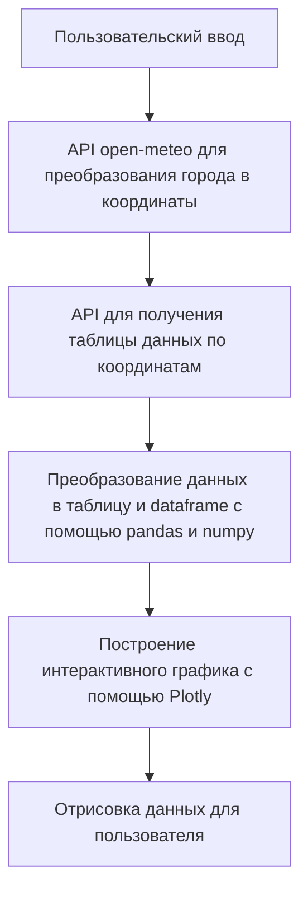

# Weatherman

## API для получения прогноза погоды по названию населенного пункта

### Реализованный функционал:
- [x] Вывод прогноза погоды интерактивным графиком
- [x] Сохранение последнего запроса с его повторной отправкой при обновлении страницы
- [x] Сохранение истории поиска пользователя
- [x] Приятный дизайн и анимация вывода в зависимости от полученных данных

### Реализация:
Программа реализована с помощью фреймворка Django и имеет следующую схему работы:


### Технологии:
- **Логика программы: Python, Django**
- **Графики: Ploty**
- **Разметка: HTML**
- **Дизайн и анимация: CSS, JavaScript**

### Особенности работы:

- Хоть мы и используем POST форму при отправке города на open.meteo API, в программе отсутствует непосредственная система авторизации,
поэтому CSRF токен отключен через декоратор *@csrf_exempt* в функции *search_city*.
Если вы хотите изменить это поведение - удалите декоратор и настройте способ получения токена внутри сессии в *settings.py*.

- Секретный ключ, необходимый для работы приложения, должен находится в локальным файле *.env*.
Если вы не задали его, он будет сгенерирован при запуске приложения.
Если вы хотите произвести генерацию ключа самостоятельно, сделать это можно в отдельном файле при помощи кода:
```python
from django.core.management.utils import get_random_secret_key
print(get_random_secret_key())
```
или
```python
import secrets
print(secrets.token_urlsafe(50))
```
И затем вставить в файл .env
```python
SECRET_KEY=*сгенерированный программой ключ*
```
- Ввод города пользователем может быть произведен на любом языке, но ответ приходит на английском. Исключение составляют локации, для которых не задан англоязычный вывод внутри open-meteo. Эти локации будут представлены на языке, на котором они были записаны в open-meteo.
- Температура, выведенная на экран, является текущей температурой в заданном городе в часовом поясе GMT +03, полученной из данных API. Изменить это поведение можно внутри функции *search_city*, задав другой временной сдвиг для переменной *timedelta*.

### Демо
https://github.com/user-attachments/assets/e8b522cf-e7ad-4904-a048-d5a33d59164b


### **Установка и запуск**

#### Сначала клонируйте репозиторий на ваш локальный компьютер:
```bash
git clone https://github.com/Dopelen/Weatherman.git
```
#### Установите виртуальное окружение, чтобы избежать возможного конфликта версий библиотек
```
python -m venv venv
```
#### Активируйте виртуальное окружение:
##### На Windows:
```bash
venv\Scripts\activate
```
##### На macOS и Linux:
```bash
source venv/bin/activate
```
#### Перейдите в папку с проектом и установите зависимости
```
pip install -r requirements.txt
```
#### Настройка переменных окружения
Создайте файл .env в корневом каталоге проекта и добавьте необходимые переменные окружения:
```
SECRET_KEY=ваш секретный ключ
```
#### Применение миграций базы данных
```bash
python manage.py migrate
```
#### Запустите сервер разработки
```
python manage.py runserver
```
#### Перейдите в браузер, проект будет доступен по адресу
**http://127.0.0.1:8000/**
##### Если у вас возникают проблемы с отсутствием статических файлов, убедитесь, что вы выполнили команду:
```
python manage.py collectstatic
```
