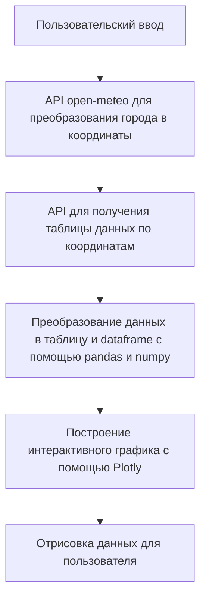

# Weatherman
## Проект в работе!
## Не исключено, что при следующем посещении здесь появится дополнительный функционал!
### Запрашиваемый функционал:

#### Основные требования:
- [x] *Вывод данных (прогноза погоды) должен быть в удобно читаемом формате.
- [x] Веб фреймворк можно использовать любой.
- [x] api для погоды:* https://open-meteo.com/ (можно использовать какое-нибудь другое, если вам удобнее)

#### Дополнительные требования:
- [x] при повторном посещении сайта будет предложено посмотреть погоду в городе, в котором пользователь уже смотрел ранее
- [x] будет сохраняться история поиска для каждого пользователя, и будет API, показывающее сколько раз вводили какой город

#### В процессе разработки:
- [ ] написаны тесты
- [ ] сделаны автодополнение (подсказки) при вводе города
- [ ] Всё помещено в докер контейнер

### Реализация:
Программа реализована с помощью фреймворка Django и её схема работы довольно проста:

В момент получения координат, мы уже знаем, был ли запрос успешен или нет. 
Тогда и добавляем в нашу "историю поиска" полученный город.

Логика программы написана на Python, график построен с помощью ploty, основная разметка - HTML, дизайн и анимация - CSS, присутствует одна JavaScript функция для отображения истории поиска :)

### Демо
https://github.com/user-attachments/assets/88fd849b-c9ce-4bfd-ae85-1fa32db33051

