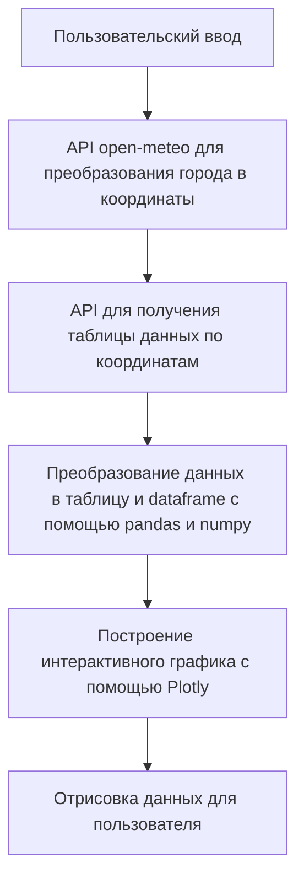

# Weatherman
## Проект в работе!
## Не исключено, что при следующем посещении здесь появится дополнительный функционал!
### Запрашиваемый функционал:

#### Основные требования:
- [x] *Вывод данных (прогноза погоды) должен быть в удобно читаемом формате.
- [x] Веб фреймворк можно использовать любой.
- [x] api для погоды:* https://open-meteo.com/ (можно использовать какое-нибудь другое, если вам удобнее)

#### Дополнительные требования:
- [x] при повторном посещении сайта будет предложено посмотреть погоду в городе, в котором пользователь уже смотрел ранее
- [x] будет сохраняться история поиска для каждого пользователя, и будет API, показывающее сколько раз вводили какой город

#### В процессе разработки:
- [ ] написаны тесты
- [ ] сделаны автодополнение (подсказки) при вводе города
- [ ] Всё помещено в докер контейнер

### Реализация:
Программа реализована с помощью фреймворка Django и её схема работы довольно проста:

В момент получения координат, мы уже знаем, был ли запрос успешен или нет. 
Тогда и добавляем в нашу "историю поиска" полученный город.

Логика программы написана на Python, график построен с помощью ploty, основная разметка - HTML, дизайн и анимация - CSS, присутствует одна JavaScript функция для отображения истории поиска :)


### Демо
https://github.com/user-attachments/assets/88fd849b-c9ce-4bfd-ae85-1fa32db33051


### Установка и запуск
#### Сначала клонируйте репозиторий на ваш локальный компьютер:
```bash
git clone https://github.com/Dopelen/Weatherman.git
```
#### Установите виртуальное окружение, чтобы избежать возможного конфликта версий библиотек
```
python -m venv venv
```
#### Активируйте виртуальное окружение:
##### На Windows:
```bash
venv\Scripts\activate
```
##### На macOS и Linux:
```bash
source venv/bin/activate
```
#### Установите зависимости
```
pip install -r requirements.txt
```

#### Настройка переменных окружения
Создайте файл .env в корневом каталоге проекта и добавьте необходимые переменные окружения:
```
SECRET_KEY=your_secret_key
DEBUG=True
ALLOWED_HOSTS=localhost,127.0.0.1
```

#### Применение миграций базы данных
```bash
python manage.py migrate
```

#### Запустите сервер разработки
```
python manage.py runserver
```

#### Перейдите в браузер, проект будет доступен по адресу
**http://127.0.0.1:8000/**

##### Если у вас возникают проблемы с отсутствием статических файлов, убедитесь, что вы выполнили команду:
```
python manage.py collectstatic
```
